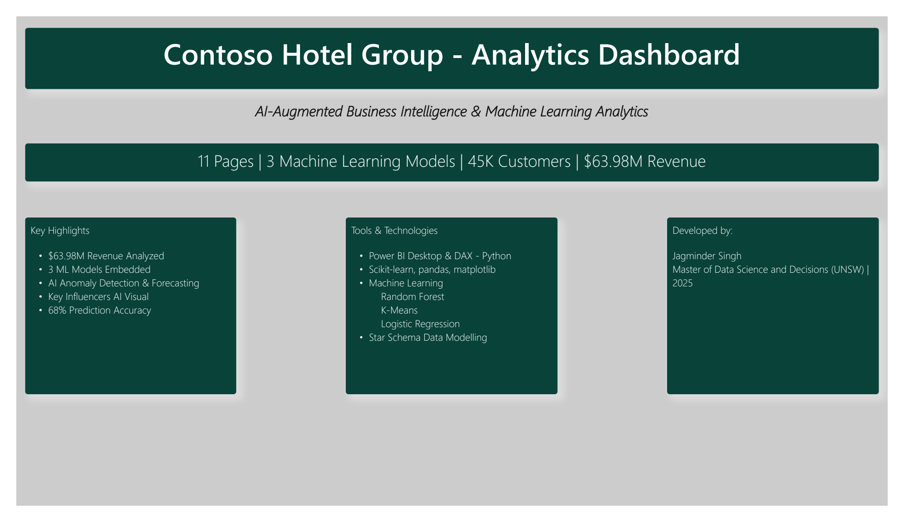
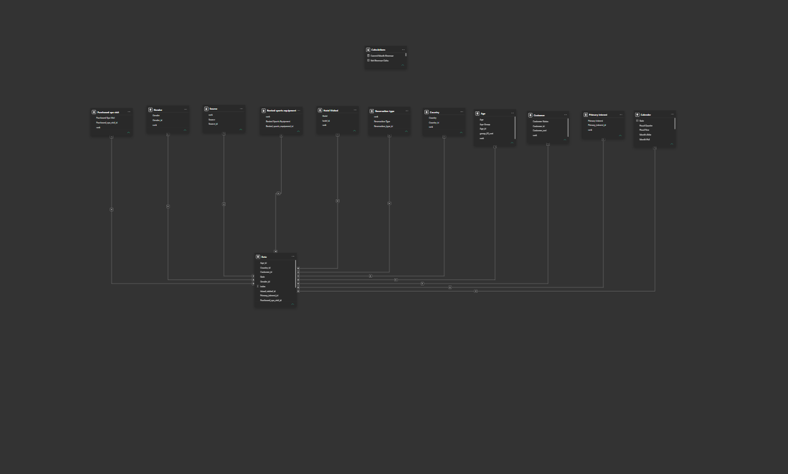
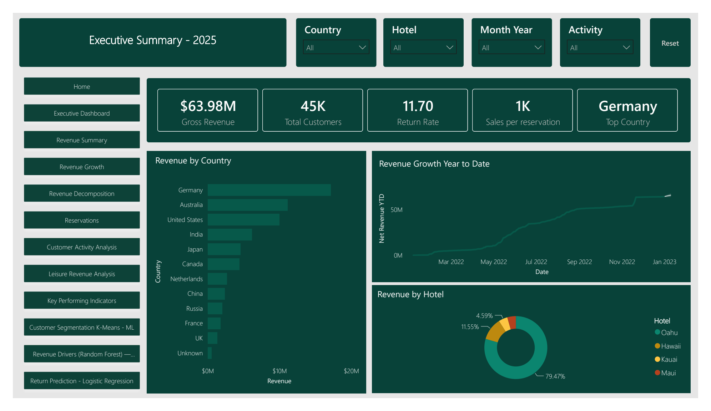
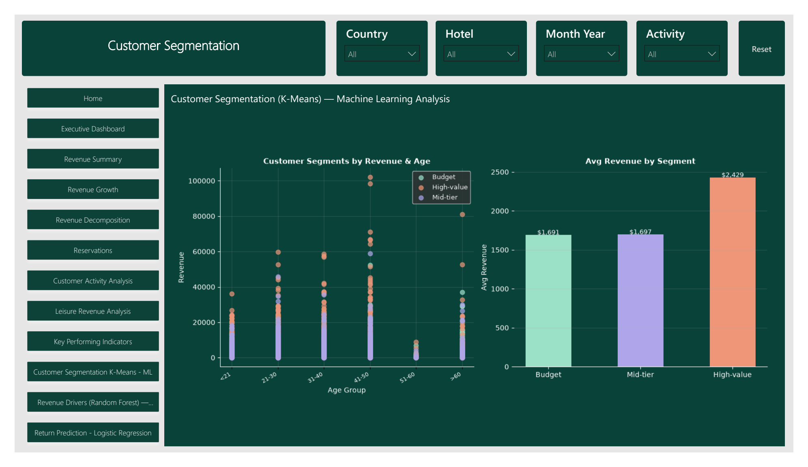
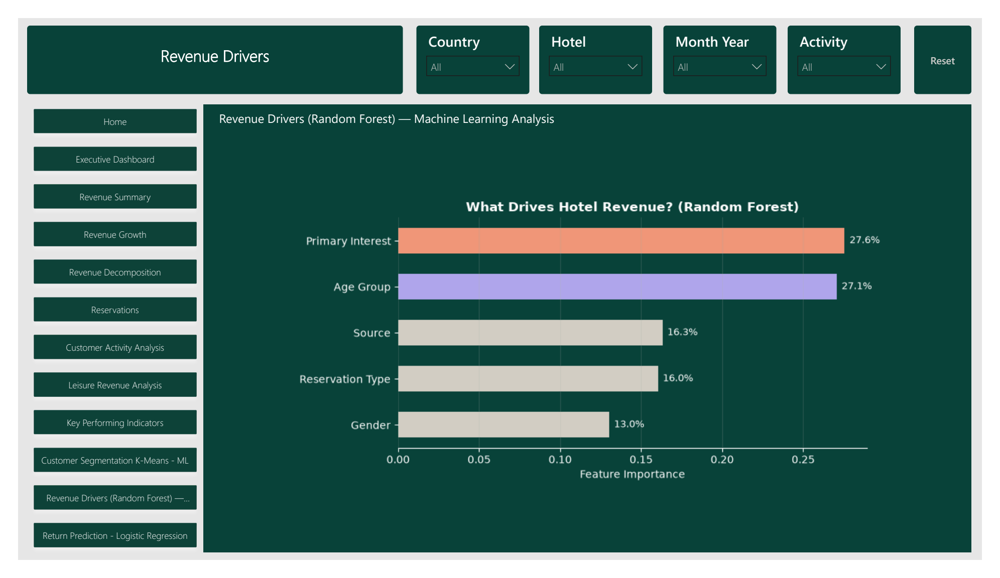
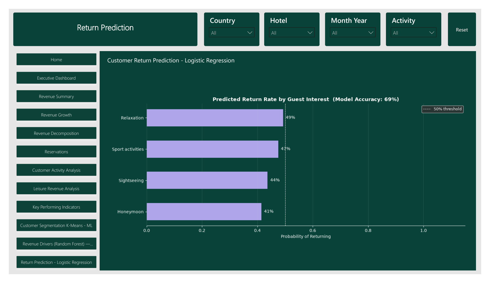
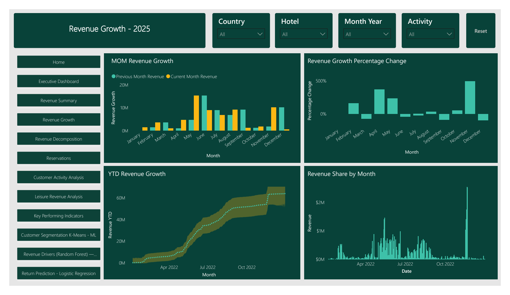
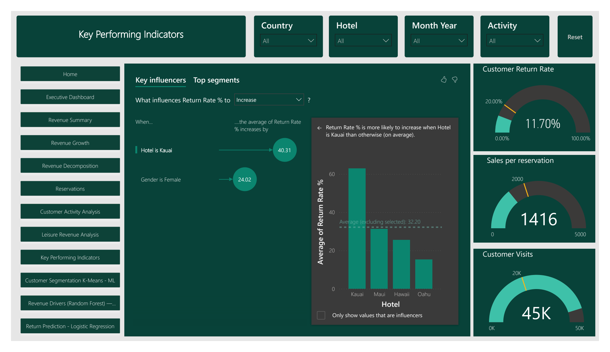

# Contoso Hotel Group Analytics Dashboard

A machine-learning-enhanced Power BI portfolio project for a fictional hotel group.

## Project overview

This project turns hotel revenue, reservation, customer, and leisure-activity data into an interactive 11-page Power BI report. It was developed as part of the Master of Data Science and Decisions program at UNSW, with a strong focus on integrating Python-based machine learning into a business intelligence dashboard.

The project demonstrates data preparation, DAX measures, interactive report design, semantic modelling, business interpretation, and machine-learning visualisation.

| Headline result | Value |
| --- | ---: |
| Revenue analysed | $63.98M |
| Customers analysed | 45K |
| Interactive report pages | 11 |
| Embedded machine-learning models | 3 |

## Project status

| Project area | Status |
| --- | --- |
| Interactive Power BI dashboard | Complete |
| Machine-learning analysis and visuals | Complete |
| PDF and image portfolio exports | Complete |
| Semantic modelling | Complete |

## Machine learning at the centre of the project

Machine learning is the main advanced-analytics component of this dashboard. Three complementary models are used to move beyond descriptive reporting and explore customer behaviour, revenue drivers, and return propensity.

| Model | Analytical purpose | Dashboard output |
| --- | --- | --- |
| **K-Means clustering** | Discover natural customer groups using age and revenue behaviour | Budget, Mid-tier, and High-value customer segments |
| **Random Forest** | Estimate the relative importance of customer and booking attributes | Ranked revenue drivers and feature-importance percentages |
| **Logistic Regression** | Estimate the probability that a customer will return | Predicted return rate by primary guest interest |

The report also uses Power BI analytical features such as Key Influencers, anomaly detection, and forecasting to complement the Python and scikit-learn models.

## Semantic modelling

The Power BI model uses a star-schema-style design centred on the `Data` fact table. One-to-many relationships connect the fact table to descriptive dimensions, allowing filters to flow consistently through revenue, customer, reservation, and activity analysis.

The semantic model includes dimensions for:

- Calendar
- Customer
- Country
- Age group
- Gender
- Hotel visited
- Source
- Reservation type
- Primary interest
- Purchased spa visit
- Rented sports equipment

This structure separates descriptive attributes from transactional values, supports reusable DAX measures, and provides a consistent analytical foundation for the dashboard and embedded machine-learning visuals.

## Dashboard overview

The report covers:

- Executive KPIs and revenue performance
- Country, hotel, gender, and monthly revenue analysis
- Month-over-month and year-to-date growth
- Revenue decomposition and key influencers
- Reservation source, type, and guest-interest patterns
- Customer activity and leisure revenue by age group
- Customer segmentation using K-Means
- Revenue-driver analysis using Random Forest
- Customer-return prediction using Logistic Regression

## Business questions

The dashboard was designed to explore questions such as:

- Which countries and hotels generate the most revenue?
- How does revenue change over time?
- Which customer interests and demographic groups contribute most strongly?
- Which factors are most influential in hotel revenue?
- What customer segments emerge from revenue and age behaviour?
- How likely are guests with different interests to return?

## Machine-learning analysis

The machine-learning workflow connects Power BI data with Python: the selected report fields are prepared with pandas, processed by scikit-learn, visualised with matplotlib, and displayed inside the Power BI report. This allows model outputs to sit alongside business KPIs and respond to the wider reporting context.

### Customer segmentation - K-Means

K-Means provides an unsupervised view of the customer base. Guests are grouped into Budget, Mid-tier, and High-value segments using age and revenue behaviour, making differences between customer groups easier to communicate.

### Revenue drivers - Random Forest

Random Forest is used to examine non-linear relationships between customer attributes and hotel revenue. Feature importance compares the contribution of primary interest, age group, source, reservation type, and gender, highlighting the strongest revenue drivers.

### Return prediction - Logistic Regression

Logistic Regression estimates the probability that a customer will return. The model output is summarised by guest interest and displayed against a 50% reference threshold, turning individual predictions into an accessible business visual.

## Additional analytics

### Revenue growth

### Key performance indicators and influencers

## Technology stack

- Microsoft Power BI Desktop
- DAX measures and interactive report design
- Python
- pandas and matplotlib
- scikit-learn
- Random Forest, K-Means, and Logistic Regression
- Star-schema semantic modelling and table relationships

## Repository contents

| Path | Description |
| --- | --- |
| [`report/Contoso-Hotel-Analytics.pbix`](Contoso-Hotel-Analytics.pbix) | Interactive Power BI project file |
| [`report/Contoso-Hotel-Analytics.pdf`](Contoso-Hotel-Analytics.pdf) | Static 12-page portfolio export |

## How to explore the project

1. Download the `.pbix` file from folder.
2. Open it with Microsoft Power BI Desktop.
3. Use the Country, Hotel, Month Year, and Activity slicers to explore the report.
4. If Power BI Desktop is unavailable, open the PDF version for a complete static walkthrough.

## Academic project notice

This repository is an academic and portfolio demonstration. The machine-learning models are presented as analytical learning outcomes rather than production decision systems. Contoso is used as a fictional case-study brand, and the project is not presented as an official report for a real hotel organisation.

## Author

**Jagminder Singh** 
Master of Data Science and Decisions, UNSW
